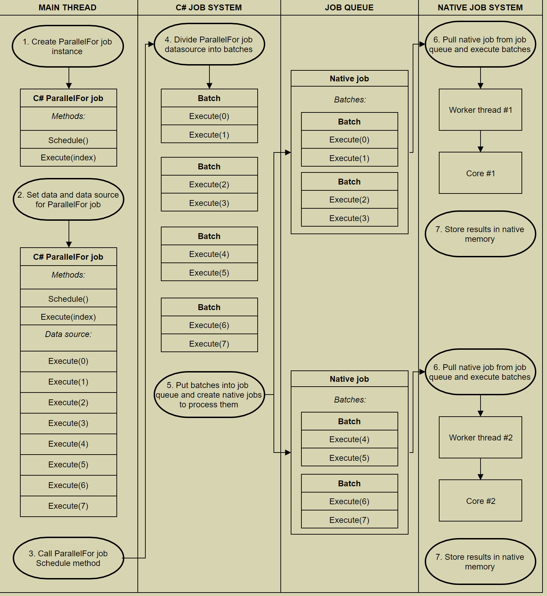

# =========================================================== #
#       C# Job System
# =========================================================== #

[文档中文翻译就挺好]

job system 允许你编写 简单且高性能的 多线程代码, 它可与 unity engine 交互,
以提高 游戏性能.

可以将 job system 和 Entity Component System (ECS) 结合使用.
ECS 是一种架构, 它能编写 简洁且高效的全平台机器码.

# =========================================================== #
#       C# Job System Overview
# =========================================================== #

# How the C# Job System works

编写多线程代码 能获得高性能收益. 比如较高的帧率. 
将 Burst 编译器 和 job 结合使用 可提高 代码生成质量, 它还能降低 移动设备的耗电量.

C# Job System 的一个重要方面是,它与 unity native job system 相结合. 
用户写的代码 和 unity 共享 worker threads.
这种合作避免了生成超出 cpu cores 数量的线程, 后者会导致 cpu资源的争夺.

推荐收看:
https://www.youtube.com/watch?v=kwnb9Clh2Is&t=1s

# =========================================================== #
#      What is multithreading?
# =========================================================== #

略...

为避免频繁地创建并销毁 线程,可以使用 线程池. 即便如此,同一时间地活跃线程仍然很多. 过多线程导致地 cpu资源争夺, 会引发频繁地 context switching.

# =========================================================== #
#      What is a job system?
# =========================================================== #
job system 通过创建 job 而不是 线程, 来实现多线程编程.
(tprpix 用的就是 job system)

一个 job system 在多个 cpu核心间,管理一组 worker threads.
通常,为每个 cpu逻辑核心 分配一个 worker thread, 以避免 context switching.
(当然,它还是会为 操作系统 和 其他专用程序 保留部分核心) 

job system 将一个 job 推入 job queue, worker threads 从 queue 中取出这些 job,并执行它们.

job system 管理 dependencies:
http://tutorials.jenkov.com/ood/understanding-dependencies.html

并确保 job 以适当地顺序被执行.

# What is a job?
一个 job,就是一个 小代码片段. job 可以是 self-contained(独立的), 也可以 依赖于另一个 job, 需要其他 job 完成之后,自己再执行.

# What are job dependencies?
复杂系统中地 job 不能总要求是 独立的, 一个 job 常常为另一个 job 准备数据. job 知道这层关系,并且 support dependencies 来使得这一切能运作. job system 要保证 相互依赖的 job 间的正确运行顺序和时机.

# =========================================================== #
#     The safety system in the C# Job System
# =========================================================== #

# Race conditions
当编写 多线程代码, 总存在风险会导致 race conditions. 
当一个操作的输出 依赖于 另一个超出它控制的操作的时机 时, race condition 就会发生.

race condition 并不总是 bug, 但它是 不确定性行为的 来源. 当一个 race condition 确实引发了一个 bug, 查找出根源是很困难的, 因为它依赖于时机, 所以你只能罕见地再次复现这个 bug. 

race condition 是 多线程编程的最大挑战.

# Safety system
unity c# job system 能查出所有潜在的 race condition, 保护你免于 bug.

比如: 如果主线程向 job 传入一个 引用. 我们是无法保证, 在子线程处理此job,向这个引用写入数据时,主线程是不是在读取这个引用. 这个行为将导致 race conditon.

c# job system 的做法是, 向job传入 数据的 copy,而不是引用. 这隔离了数据.

job system 的着这种复制行为, 意味着 job 只能访问 Blittable types(c# 中的术语). 这种类型在 managed(托管) 和 原生代码 之间传递时 无需 转换.

c# job system 可以用 memcpy (c/c++中的函数) 复制 Blittable types, 并将这个数据在 托管和原生unity代码 间传递. 在 "调度"job时,它使用 memcpy 将数据写入 原生内存, 且在执行时, 允许 托管代码 访问这些数据.

# =========================================================== #
#     NativeContainer
# =========================================================== #
如前文,复制数据的缺点是, 它还隔离了 每个job的结果. 为克服它, 你需要将结果存储在一种被称为 "NativeContainer" 的共享内存 中.

# What is a NativeContainer?
一个 nativecontainer 是一个托管的值类型,它提供一个相对安全的 对原始内存的 c# wrapper(包装). 它包含一个 指针, 指向一个 unmanaged allocation(未托管分配器).
当和 unity c# job system 一起使用时, 一个 NativeContainer 允许一个 job 与 主线程 共享一个数据, 而不是工作在一个 数据的copy 上.

# What types of NativeContainer are available?
Unity 附带了一个名为 NativeArray 的 NativeContainer。您也可以使用 NativeSlice 操作 NativeArray，从特定位置获取特定长度的 NativeArray 子集。

注意, ECS 可以扩展 Unity.Collections namespace, 以 include 其他类型的
NativeContainer:

-- NativeList - 可调整大小的 NativeArray。
-- NativeHashMap - 键/值对。
-- NativeMultiHashMap - 每个键有多个值。
-- NativeQueue - 先进先出 (FIFO) 队列。

# NativeContainer and the safety system
safety system 内置于所有 NativeContainer 类型中, 它会跟踪在 NativeContainer 中读写的内容。

注意: 在 NativeContainer 上的所有 safety check(安全检查) (比如: 边界越界检查, 取消分配检查, race condition检查) 只能在 unity editor 和 play mode 下进行.

这个 safety system 的一部分是:  DisposeSentinel and AtomicSafetyHandle
DisposeSentinel 检查内存泄漏, 如果你不正确释放内存,将获得 error. 内存泄漏发生很长时间后才会触发内存泄漏错误。

使用 AtomicSafetyHandle 可以在代码中转移 NativeContainer 的所有权。
例如，如果两个调度的 job 正在写入相同的 NativeArray，则 safety system 会抛出一个异常，并显示一条明确的错误消息，说明问题的原因和解决方法。调度违规的 job 时， safety system 会抛出此异常。

在这种情况下，可以调度具有依赖关系的 job 。第一个 job 可以写入 NativeContainer，一旦该 job 完成执行，下一个 job 就可以安全地读取和写入相同的 NativeContainer。从主线程访问数据时，读写限制也适用。
安全系统允许多个 job 并行读取相同的数据。

默认情况下，当 job 可以访问 NativeContainer 时，该 job 便具有读写访问权限。此配置可能会降低性能。
C# job system 不允许在一个 job 正在写入 NativeContainer 的同时再调度另一个 job 对其进行写访问。

如果 job 不需要写入 NativeContainer，请用 [ReadOnly] 属性标记 NativeContainer，如下所示：

[ReadOnly]
public NativeArray<int> input;

在上面的示例中，允许多个 job 同时对 NativeArray 进行只读访问。

注意：
从 job 中访问 static 数据 是没有任何保护的。访问静态数据时会绕过所有 safety system，并可能导致 Unity 崩溃。如需了解更多信息，请参阅:
C# Job System tips and troubleshooting.

# NativeContainer Allocator
创建 NativeContainer 时，必须指定所需的内存分配类型。分配类型取决于 job 运行的时间长度。因此，可以定制分配以便在每种情况下获得最佳性能。

可以使用三种 Allocator 类型进行 NativeContainer 内存分配和释放。在实例化 NativeContainer 时需要指定适当的一种类型。

-1- Allocator.Temp 
    具有最快的分配速度。此类型适用于寿命为一帧或更短的分配。不应该使用 Temp 将 NativeContainer 分配传递给 job 。在从方法调用（例如 MonoBehaviour.Update 或从原生代码到托管代码的任何其他回调）返回之前，还需要调用 Dispose 方法。

-2- Allocator.TempJob 
    它的分配速度比 Temp 慢，但比 Persistent 快。此类型适用于寿命为四帧的分配，并具有线程安全性。如果没有在四帧内对其执行 Dispose 方法，console 会输出一条从 native code 生成的警告。大多数小的 job 都使用这种 NativeContainer 分配类型。

-3- Allocator.Persistent 
    它是最慢的分配，但可以在您所需的任意时间内持续存在，如果有必要，可以在整个应用程序的生命周期内存在。此分配器是直接调用 malloc 的封装器。持续时间较长的 job 可以使用这种 NativeContainer 分配类型。在非常注重性能的情况下不应使用 Persistent。

举例:

NativeArray<float> result = new NativeArray<float>(1, Allocator.TempJob);

注意：上例中的数字 1 表示 NativeArray 的大小。在此例子中只有一个数组元素（因为只会在 result 中存储一个数据）。

# =========================================================== #
#     Creating jobs
# =========================================================== #

要创建 job，必须实现 IJob 接口。借助 IJob，可以调度一个 job,它与其它正在运行的 job 并行运行.

注意：“job” 是 Unity 中对于任何实现 IJob 接口的 struct 的统称。

要创建 job ，你需要：
-- 创建一个 struct, 它继承于 IJob 接口。
-- 添加该 job 使用的成员变量（ blittable 类型,或 NativeContainer 类型）
-- 在 struct 中实现一个名为 Execute 的方法, 并在其中实现 job 主体内容

在执行 job 时, Execute 方法在一个 cpu核心上 运行一次.

注意：在设计 job 时，请记住它们是对数据copy 进行操作，除非使用到了 NativeContainer。因此，从主线程中的 job 访问数据的唯一方法是写入 NativeContainer。

# An example of a simple job definition

// Job adding two floating point values together
public struct MyJob : IJob
{
    public float a;
    public float b;
    public NativeArray<float> result;

    public void Execute()
    {
        result[0] = a + b;
    }
}

# =========================================================== #
#     Scheduling jobs
# =========================================================== #

为了在主线程中 "调度" 一个 job,你必须:
-- 实例化 该 job
-- 填充 job 的数据
-- 调用 Schedule 方法
    (IJobExtensions.Schedule)

声明:
public static Unity.Jobs.JobHandle Schedule(
        T jobData, 
        Unity.Jobs.JobHandle dependsOn
        );

调用 Schedule 会把 job 压入 job queue 中, 以便在后续合适的时间点 执行它们.
一旦 Schedule, 你不就能再 阻碍这个 job 了.

注意: 在主线程中,你只能调用 Schedule 方法.

# An example of scheduling a job

// Create a native array of a single float to store the result. This 
// example waits for the job to complete for illustration purposes
NativeArray<float> result = new NativeArray<float>(1, Allocator.TempJob);

// Set up the job data
// 这个 MyJob 在上文 已经声明了
MyJob jobData = new MyJob();
jobData.a = 10;
jobData.b = 10;
jobData.result = result;

// Schedule the job
JobHandle handle = jobData.Schedule();

// Wait for the job to complete
handle.Complete();

// All copies of the NativeArray point to the same memory, 
// you can access the result in "your" copy of the NativeArray
float aPlusB = result[0];

// Free the memory allocated by the result array
result.Dispose();

# =========================================================== #
#     JobHandle and dependencies
# =========================================================== #

调用 Schedule 方法将返回一个 JobHandle 类型对象. 
你也可以在 job 代码中使用 JobHandle, 当作其他 job 的 dependency (依赖项)
如果一个 job 依赖于另一个 job 的运行结果. 你可以把第一个 job 返回的 JobHandle
项 当作一个参数 传入第二个 job 的 Schedule 方法中:

JobHandle firstJobHandle = firstJob.Schedule();
secondJob.Schedule(firstJobHandle);

# Combining dependencies
如果一个 job 存在数个 dependencies, 可使用 JobHandle.CombineDependencies 方法来将它们组合. 这个方法输入 一组 JobHandle, 返回一个合成后的 JobHandle,
可以直接将这个 方法 写在 Schedule 的参数位置上:

NativeArray<JobHandle> handles = new NativeArray<JobHandle>(numJobs, Allocator.TempJob);

JobHandle jh = JobHandle.CombineDependencies(handles);

# Waiting for jobs in the main thread
在主线程上调用 Jobhandle 的 Complete 方法, 可以强制主线程等待 job 直到它执行完毕. 当 Complete 方法返回后,就意味着 可以在主线程上完全的访问 job 使用的 NativeContainer 了.

注意:
当你在 schedule 一个 job 时,他不会被立即执行. 调用 Complete 还能刷新 内存缓存中的 jobs, 启动执行流程. 在一个 JobHandle 上调用 Complete, 会将这个 job 的  NativeContainer 的所有权 交还给 主线程. 
此外，也可以通过在 jb依赖关系中的 JobHandle 上调用 Complete 来将所有权交还给主线程。
例如，可以在 jobA 上调用 Complete，也可以在依赖于 jobA 的 jobB 上调用 Complete。两种方式都会使 jobA 使用的 NativeContainer 类型在调用 Complete 之后可以在主线程上安全地访问。

否则,如果你不需要访问这些数据, 你需要显式地 刷新批次, 通过调用 static方法:
JobHandle.ScheduleBatchedJobs, 声明:

public static void ScheduleBatchedJobs();

请注意，调用此方法会对性能产生负面影响。

# An example of multiple jobs and dependencies

# Job code:
// Job adding two floating point values together
public struct MyJob : IJob
{
    public float a;
    public float b;
    public NativeArray<float> result;

    public void Execute()
    {
        result[0] = a + b;
    }
}

// Job adding one to a value
public struct AddOneJob : IJob
{
    public NativeArray<float> result;
    
    public void Execute()
    {
        result[0] = result[0] + 1;
    }
}

# Main thread code:
// Create a native array of a single float to store the result in. 
// This example waits for the job to complete
NativeArray<float> result = new NativeArray<float>(1, Allocator.TempJob);

// Setup the data for job #1
MyJob jobData = new MyJob();
jobData.a = 10;
jobData.b = 10;
jobData.result = result;

// Schedule job #1
JobHandle firstHandle = jobData.Schedule();

// Setup the data for job #2
AddOneJob incJobData = new AddOneJob();
incJobData.result = result; // 两 job 使用相同的 NativeContainer

// Schedule job #2
// 确认依赖关系
JobHandle secondHandle = incJobData.Schedule(firstHandle);

// Wait for job #2 to complete
// 尽管仅调用了 job2 的 Complete, 但其实也要求 job1 先完成执行
secondHandle.Complete();

// All copies of the NativeArray point to the same memory, 
// you can access the result in "your" copy of the NativeArray
float aPlusB = result[0];

// Free the memory allocated by the result array
result.Dispose();

# =========================================================== #
#     ParallelFor jobs
# =========================================================== #
在 shceduling jobs 时, 一个 job 只能执行一个任务.
但在游戏中,往往需要对大量物体执行相同的任务, 有一种额外的 job 类型,
称作 IJobParallelFor 能处理此问题.

注意: “ParallelFor” job 是 Unity 中对于任何实现 IJobParallelFor 接口
的 struct 的统称。

ParallelFor job 使用一个 NativeArray 作为其数据源. ParallelFor jobs 在多个 cpu核心上运行. 每个核心都有一个 job, 每个 job 处理 工作量的一部分.
IJobParallelFor 的行为类似于 IJob, 但并不是调用单个 Execute 方法，而是对数据源中的每一项都调用一次 Execute 方法. 在 Execute 方法中,存在一个 整形参数, 它是一个 idx, 用于访问和操作 job 实现中的数据源的单个元素。

# An example of a ParallelFor job definition:

struct IncrementByDeltaTimeJob: IJobParallelFor
{
    public NativeArray<float> values;
    public float deltaTime;

    public void Execute (int index)
    {
        float temp = values[index];
        temp += deltaTime;
        values[index] = temp;
    }
}

# Scheduling ParallelFor jobs
在调度 ParallelFor job 时，必须指定 NativeArray 数据源的长度,它将被拆成一块一块的。长度还告诉 C# job system 应该要期待多少个 Execute 方法。

在后台，ParallelFor job 的调度更加复杂。在调度 ParallelFor jobs 时，C# job system 将工作分成多个 batch 以便在多个核心之间分配任务。每个 batch 包含一小部分 Execute 方法(数个)。
然后，针对每个 CPU 核心，C# job system 会在 Unity’s native job system 中调度最多一个 job，并向该 native job 传递一些需要完成的 batchs。

当一个 native job 先于其他 job 之前完成自己负责的 batch，它会从其他 native job 那窃取剩余 batchs。它一次只能窃取 native job 剩余batchs的一半，以确保
cache locality(缓存局部性)。
 

要优化该过程，必须指定 batch count (猜测是一个 batch 内的 job 个数).
batch count 可以控制您获得的 job 数量，以及线程之间重新分配工作的 细粒度。
把 batch count 设置得较低（如1）可使线程之间的工作分布更均匀. 但这样也会增加一些开销. 所以推荐的办法是先设置为 1, 然后逐渐增加, 直到 性能不在增长为止.

# An example of scheduling a ParallelFor job

# Job code:

// Job adding two floating point values together
public struct MyParallelJob : IJobParallelFor
{
    [ReadOnly]
    public NativeArray<float> a;
    [ReadOnly]
    public NativeArray<float> b;
    public NativeArray<float> result;

    public void Execute(int i)
    {
        result[i] = a[i] + b[i];
    }
}

# Main thread code:

NativeArray<float> a = new NativeArray<float>(2, Allocator.TempJob);
NativeArray<float> b = new NativeArray<float>(2, Allocator.TempJob);
NativeArray<float> result = new NativeArray<float>(2, Allocator.TempJob);

a[0] = 1.1;
b[0] = 2.2;
a[1] = 3.3;
b[1] = 4.4;

MyParallelJob jobData = new MyParallelJob();
jobData.a = a;  
jobData.b = b;
jobData.result = result;

// Schedule the job with one Execute per index in the results array 
// and only 1 item per processing batch
// 参数1: 
// 参数2: batch count, 可以从1起步,有时可被设为 32,64
JobHandle handle = jobData.Schedule(result.Length, 1);

// Wait for the job to complete
handle.Complete();

// Free the memory allocated by the arrays
a.Dispose();
b.Dispose();
result.Dispose();

# =========================================================== #
#     ParallelForTransform jobs
# =========================================================== #

ParallelForTransform job 是另一种 ParallelFor job；专为操作 Transforms. 组件而设计。

注意：ParallelForTransform job 是 Unity 中对于任何实现 IJobParallelForTransform 接口的 job 的统称。

# =========================================================== #
#     C# Job System tips and troubleshooting
# =========================================================== #

请确保遵守以下要求：

# Do not access static data from a job
从 job 访问静态数据时会绕过所有安全系统。如果访问错误的数据，通常可能会以意想不到的方式导致 Unity 崩溃。例如，访问 MonoBehaviour 可能会导致在域重新加载时崩溃。

注意：由于存在这种风险，Unity 的未来版本将使用  static analysis 从阻止 job 进行全局变量访问。如果确实要访问 job 中的静态数据，则应考虑到您的代码可能会在 Unity 的未来版本中发生中断。

# Flush scheduled batches  刷新已调度的批次

如果希望 jobs 开始执行，则可以使用 JobHandle.ScheduleBatchedJobs() 刷新已调度的 batchs。请注意，调用此方法会对性能产生负面影响。
不刷新 batchs 会将调度延迟到主线程等待结果的时候。
在所有其他情况下，请使用 JobHandle.Complete 来启动执行过程。

注意：在 ECS 中会隐式刷新批次，因此没必要调用 JobHandle.ScheduleBatchedJobs。

# Don’t try to update NativeContainer contents

由于缺少 ref returns，因此无法直接更改 NativeContainer 的内容。
例如:
nativeArray[0]++; 
与 
var temp = nativeArray[0]; temp++; 
等效，这个操作不会更新 nativeArray 中的值。

正确的做法是，必须将目标数据复制到本地，修改该临时copy，然后将其存回，如下所示：
MyStruct temp = myNativeArray[i];
temp.memberVariable = 0;
myNativeArray[i] = temp;

# Call JobHandle.Complete to regain ownership
# 调用 JobHandle.Complete 以重新获得所有权

要跟踪数据所有权，必须先完成依赖项，然后主线程才能再次使用这些依赖项。仅检查 JobHandle.IsCompleted 是不够的。必须调用 JobHandle.Complete 方法以便将 NativeContainer 类型的所有权重新交还给主线程。调用 Complete 也会清理 safety system 中的状态。不这样做会引发内存泄漏。
如果在每一帧调度新job且每一帧依赖于前一帧的job，此过程也适用。

# Use Schedule and Complete in the main thread
# 在主线程中使用 Schedule 和 Complete 方法
只能从主线程调用 Schedule 和 Complete。
如果一个 job 依赖于另一个 job ，请使用 JobHandle 来管理依赖关系，而不是尝试在 job 中调度 job。

# Use Schedule and Complete at the right time

拥有 job 所需的数据后就立即在 job 上调用 Schedule，
并仅在需要结果时才开始在 job 上调用 Complete。
最好是调度当前不与正在运行的任何其他 job 竞争的、不需要等待的 job。
例如，如果在一帧结束和下一帧开始之间的一段时间没有job正在运行，并且可以接受一帧延迟，则可以在一帧结束时 Schedule job，并在下一帧中使用其结果。
另一方面，如果游戏占满了与其他 job 的转换期，但在帧中的其他位置存在大量未充分利用的时段，那么在这个时段 Schedule job 会更加有效。

# Mark NativeContainer types as read-only
请注意，默认情况下，job 对 NativeContainer 类型具有读写访问权限。
请在适当时使用 [ReadOnly] 属性来提高性能。

# Check for data dependencies
在 Unity Profiler 窗口中，主线程上的标记 “WaitForJobGroup” 的小段,它表示 Unity 正在等待 worker thread 上的 job 完成。此标记可能意味着您已在某处引入了应处理的数据依赖关系。请查找 JobHandle.Complete 来跟踪在何处存在强制主线程等待的数据依赖关系。

# Debugging jobs
job 具有一个 Run 函数，可以使用此函数代替 Schedule ,
可立即在主线程上执行 job。以此来调试。

# Do not allocate managed memory in jobs
# 不要在 job 中分配托管内存

在 job 中分配托管内存非常慢，而且 job 无法使用 Unity Burst 编译器来提高性能。Burst 是一种新的基于 LLVM 的后端编译器技术，可以简化您的工作。此编译器获取 C# job 并生成高度优化的机器代码，从而利用目标平台的特定功能。

# Further information
-- Unity GDC 2018: C# Job System
https://www.youtube.com/playlist?list=PLX2vGYjWbI0RuXtGMYKqChoZC2b-H4tck

-- ECS package documentation
https://docs.unity3d.com/Packages/com.unity.entities@0.17/manual/index.html

-- Data Oriented Technology Stack forum
    更多讨论 和 故障排除:
https://forum.unity.com/forums/data-oriented-technology-stack.147/?_gl=1*1fb37bf*_ga*NTk3NDQwMDQwLjE2MjUyMTM1Njc.*_ga_1S78EFL1W5*MTYyNjQwNTg3OC4xNC4xLjE2MjY0MDc0NDUuMA..&_ga=2.99632670.1623209324.1626241396-597440040.1625213567

# &&&&&&&&&&&&&&&&&&&&&&&&&&&&&&&&&&&&&&&&&&&&&&&&&&&&&&&&&&&&&&&& #
#                让 jobs 支持多线程
# ---------------------------------------------------------------- #
参考 catlike bacis 06 jobs 那一章的最后两节.

    jobHandle = job.ScheduleParallel(parts[li].Length, 5, jobHandle);

使用 ScheduleParallel() 代替 Schedule();
第二个参数为 innloop batch count; 意为: 每个 job thread 一次领取几段运算回去做;
这个值如果被设置为 1, 则每一个 job thread, 每次都去总调度处那里, 领取一个运算回家做.
虽然这能将任务充分平摊, 但增加了 频繁去领取job 的时间.

可以设置为 2~5 之间;

当一段任务的计算很繁重, 这个值可以用小的, 当一段任务的计算很轻, 这个值可以用大的 

