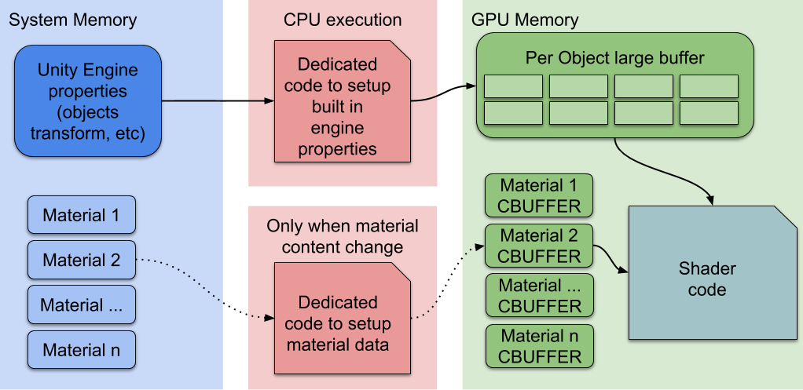

# ================================================================ #
#        Scriptable Render Pipeline introduction
# ================================================================ #
本页面展示了 srp 是如何工作的，并介绍了一些 核心概念 和 术语。这些信息也适用于 urp，hdrp。

srp 是一套 API，允许用户用 C# 配置渲染 commands。unity 将这些 commands 传输到它的 底层架构，
并在那里向 GPU 发送指令。

# Render Pipeline Asset and Render Pipeline Instance
任何 渲染管线都有两个 客制元素：

-1- Render Pipeline Asset
    继承于： RenderPipelineAsset
    它是项目中的一个 asset，存储此管线的 配置数据。

-2- Render Pipeline Instance
    继承于： RenderPipeline
    它需要 覆写一个 Render 函数，这是整个管线的 调用入口！

# ScriptableRenderContext
这是一个类，它在 “srp中的 客户 c#代码” 和 “unity底层图形代码（可能为c++）” 之间做连接。

使用此 context API 来 调度和执行 渲染指令。

# Entry points and callbacks
使用如下指令，使得 unity 可在特定时间调用 你的 c# 代码：

-- RenderPipeline.Render：
    srp 的主入口。 unity 会自动调用此函数。

-- RenderPipelineManager
    此 class 拥有一些 events，你可以订阅之。
    从而在 render loop 的特定时间点 调用你的 c#代码。

    - beginFrameRendering
    - beginCameraRendering
    - endCameraRendering
    - endFrameRendering

    ----
    问题来了，FrameRender 和 CameraRender 之间的顺序是咋样的呢 ？

# ================================================================ #
#     Scheduling and executing rendering commands 
#     in the Scriptable Render Pipeline
# ================================================================ #
本网页介绍如何在 srp 中 调度和执行 渲染 commands。
-- 要么使用 commandbuffers，
-- 要么直接使用 ScriptableRenderContext API调用

本文也适用于 urp，hdrp。

在 srp 中，你先使用 c# 来 配置和调度 渲染 commands。
然后，你再要求 unity图形底层代码去 执行这些 commands，在那里，它们将向 gpu 发送指令。

两种方法都可以实现此目标：
-1- 立刻 “execute” commandbuffers （其实还是调度，仍然是延时执行）
-2- 调用 ScriptableRenderContext API

# 方法一：Using the ScriptableRenderContext APIs
srp 渲染工作采用 延时执行。

想要 “调度” 渲染 commands，你可以：

-- 使用 ScriptableRenderContext.ExecuteCommandBuffer(), 
    将 commandbuffers 传递给 ScriptableRenderContext

-- 使用  ScriptableRenderContext.Cull() 来“调度” cull 操作
    或   ScriptableRenderContext.DrawRenderers() 来“调度”  renderer 的绘制

最后，调用  ScriptableRenderContext.Submit 来要求 unity 正式执行上文堆积的 commands。
不管你是用 上文提及的哪一种方法来 “schedule” commands 的，在内部，unity 都用相同方式来
“调度”这些 commands。
并且这些 commands 会一直堆积在那，直到你调用 submit().

# 方法二：Executing CommandBuffers immediately
可直接调用  Graphics.ExecuteCommandBuffer( buffer )
这个方法不需要 context，也能直接实现 commandbuffers 的立即执行。

当然，这个 API 调用需要在 管线之外进行。

# ================================================================ #
#        Scriptable Render Pipeline (SRP) Batcher
# ================================================================ #
srp batcher 是一个 rendering loop。如果一个场景中，存在很多 mat，它们使用了相同的 shader variant，
srp batcher 可以加速这个场景的 cpu 渲染。

# Using the SRP Batcher
srp batcher 只能用于 srp 管线中。

== 为了在 urp 中激活 srp batcher：
-1- 在 Project 面板中，选择你要修改的那个 “URP Asset”（就是管线学习中的那个 RenderPipelineAsset 实例）
    这些实例 通常为 ："HighQuality", "LowQuality" 等
-2- 再到它的 Inspector 面板中，找到 Advanced，激活 SRP Batcher。

== hdrp 的 srp batcher 是自动激活的，最好不要关闭它。当然，你可以 “暂时性” 地关闭它：
-1- 还是在 Project 面板中 选中想要修改的 RenderPipelineAsset 实例
-2- 在 Inspector 面板中，选择面板 右上角的 三个点，改选 Debug Mode，此时面板内容会发生变化。
-3- 关闭 Enable SRP Batcher 选项。

你也可以在运行时 更改此配置，在 c# 代码中：
    GraphicsSettings.useScriptableRenderPipelineBatching = true;

# Supported platforms
srp batcher 几乎支持所有平台。（图标显示，2019.2 开始各平台都支持了）

（注意，在 XR 中，you can only use the SRP Batcher with the SinglePassInstanced mode ）

# How the SRP Batcher works
在 unity 中，你能在一帧的任何时间，修改任何 mat 的任何属性。然而，这样做存在一些缺点。
举例：当 DrawCall 在新的调用中开始使用一个 新的 mat 时，需要做很多额外的工作。
所以场景中的 mat 数量越多，cpu 就需要花费更多时间来 配置 GPU 数据。
传统的做法就是 降低 DrawCalls 数量，因为每一次调用 DrawCall 前，cpu 都要做一堆准备工作。
真正的 cpu 开销其实是每次 DrawCall 前的准备工作，而不是 GPU 执行 DrawCall 本身。
而这些 准备工作也 无非是把 一些 数据从 cpu 复制到 GPU 中去。

SRP Batcher 通过 批处理 “Bind 和 Draw commands序列” 来降低 GPU的设置开销。

简述：
    == 对于传统 Batch 来说，每个周期：==
        -- 收集 系统内存 中的所有 内置数据，填入 Object CBUFFER
        -- 将 Object CBUFFER 上传到 GPU
        -- 收集 系统内存 中的所有 材质数据，填入 Material CBUFFER
        -- 将 Material CBUFFER 上传到 GPU
        -- bind Material CBUFFER
        -- bind Object CBUFFER
        ++ Draw Call
        ～～ 然后检查，下一次 drawcall 的 材质 是否发生改变

    == 对于 SRP Batcher 来说，每个周期：==
        -- bind “持久的” Material CBUFFER
        -- 从一个大的 CBUFFER 中，bind “带有偏移（offset）的 Object data”
        ++ Draw Call
        ～～ 然后检查，下一次 drawcall，是否为相同的 shader variant

为了性能最大化，这些 batches 的尺寸要越大越好。为了实现这点，你可以使用任意多变的 mat实例。
但要确保 总体的 shader variants 数量尽可能的少。（毕竟以此来判断是不是要重开 Batch）

在内部 render loop 期间，当 unity 检测到一个新的 mat，cpu 会收集所有的 properties，
然后在 GPU 内存中设置不同的 constant buffers。这些 GPU buffers 的数量，取决于 shader 如何
声明自己的 CBUFFERs

在通常情况下，场景会使用很多种 mat，但只有有限数量的 shader variants。为了加速这种场景，
SRP 天生聚集了 paradigms（范例），比如：GPU data persistency（持久性）

SRP Batcher 能让 mat数据 长期存在于 GPU 内存中。如果一个 mat 的内容没有发生变动，SRP Batcher
就不需要重新设置并将新版本上传到 GPU。相反，SRP 使用一个 专用代码路径，将 unity引擎中的 roperties 
快速上传到 GPU 的一个大型 buffer 中，如图：

简述：
    它将所有 obj 的 Unity Engine properties 集中存储在一个 大的 GPU buffer 中
    而 mat数据 则被单独储存在 GPU 的 mat CBUFFER 中，已应付 随时修改。这些 CBUFFER 是长期存在的

这个方法能提高性能是因为：所有的 mat 内容现在都长期存在于 GPU 内存中。
专用代码 将所有 逐obj properties，维护进一个大型的 逐obj的 GPU CBUFFER。

# SRP Batcher compatibility（相容性）
在任何一个场景中，有些 obj 和 SRP Batcher 和睦相处，有些则不能。即便在处理 无法和睦相处的 obj时，
unity 也能正常完成渲染。这些不兼容的，将使用 standard SRP code path。

如果一个 obj 要想兼容 SRP Batcher，必须：
-- 物体必须有一个 mesh，或 skinned mesh。它不能是粒子。
-- 使用的 shader 必须和 SRP Batcher 相互兼容。hdrp/urp 中的 Lit/Unlit shader 都符合此要求
    （这些 shader 的 粒子版除外）
-- 被渲染的 obj，必须使用 MaterialPropertyBlocks

如果一个 shader 要想兼容 SRP Batcher，必须：
-- 必须在一个名为 “UnityPerDraw” 的 CBUFFER 中声明所有的 built-in engine properties。
    比如：unity_ObjectToWorld, unity_SHAr
-- 必须在一个名为 “UnityPerMaterial” 的 CBUFFER 中声明所有的 mat properties。

可以在 shader 的 Inspector 面板中查看 兼容性： SRP Batcher 条目

# Profiling with the SRP Batcher
为测量 SRP Batcher 带来的性能提升，为场景中添加  SRPBatcherProfiler.cs 脚本。
当此脚本运行时，使用 F8 键 触发 “覆盖显示”。
也可在运行时 按下 F9 来 开启/关闭 SRP Batcher。

检测出的数据 以 ms 为单位。这些时间等于所有 RenderLoop.Draw 和 Shadows.Draw 标记的耗时总和，
这些标记在一帧中被调用，而不管是在哪个线程上。

若看到 “1.31ms SRP Batcher code path“ 字样，可能主线程上的 draw call 花费了 0.31ms，剩余的 1ms
则花费在了 所有的 graphic jobs 上。

Overlay information（覆盖信息）：
在 play mode 中可看到的各种信息：

== CPU Rendering time
    指 SRP loop 在 cpu 中花费的总时间，无论使用哪种 多线程模式：single, client/worker or graphics jobs
    这是你最能看到 SRP Batcher 效果的地方。
    通过开关 SRP Batcher，来查看此值的变化。

-- (incl RT idle)
    SRP 在 渲染线程（RT）中的 idle 时间。
    这可能意味着，程序正处于 client/worker 模式，暂时没有 graphics jobs。这通常发生在：渲染线程 正在等待 主线程
    的 graphics commands。

== SRP Batcher code path (flushes)
    程序在 SRP Batcher code path 中花费的时间。这被分解为游戏渲染所有物体 所花费的时间 以及 实现阴影 的时间。
    如果 shadow 部分的时间很高，尝试减少场景中 参与 shadow cast 的 光源的数量，或在 Render Pipeline Asset 中
    选择一个 低数量的 cascades。
    
-- (flushs)数量 指的是：unity flush 了多少次场景。每执行一次，意味着遇到了一个 新 shader variant。
    这个数量越小越好。

== Standard code path (flushes)
    一些物体不兼容 SRP Batcher，unity 渲染它们的时间。比如粒子。

== Global Main Loop: (FPS)
    这一帧整个渲染 loop 的耗时。还显示了 fps 值。

# SRP Batcher data in the Unity Frame Debugger
可以在 Frame Debugger 面板中 检查 SRP Batcher “batches” 的状态。

不光显示了 此 batch 捆绑的 drawcall 数量，还显示了它为什么不能和前一个 batch 结合的原因。

--------
如果你在写自己的 srp，而不是使用现成的 urp/hdrp。
尝试实现一个通用的 “uber” shader，它有最小数量的 keywords
（但是你可以在每一个 mat 中，使用任意多的 mat parameters 以及 Material Properties）

