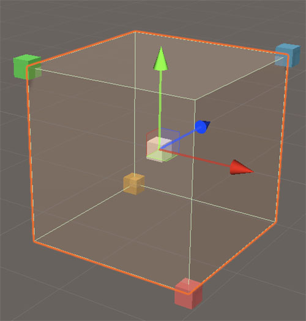

# ================================================================ #
#                      Gradient 梯度
# ================================================================ #

# ---------------------------------------------- #
#               梯度
#       Signed Distance Field
#               法线
# ---------------------------------------------- #
求一个 SDF模型 的 法线，就是 梯度的主要用途：
#
首先，SDF函数 f(x,y,z); 本质上是在一个 4维空间中的。
我们求出这个 4维空间的梯度：
    [倒三角]f(x,y,z)
    它所表达的，就是在 f(x,y,z)=0 这个特殊的 3维空间内的 梯度
    而这个梯度，恰恰是 点 (x,y,z) 上的法线。

#
理解的核心：
SDF函数 f(x,y,z) 是一个 4维空间：
不光有点坐标参数 x,y,z; 还有表达此点的值的 第四维

而一个空间的梯度，一般都会比原空间 低一个维度

# 关于 梯度求法线，最好的文：
    https://iquilezles.org/www/articles/normalsSDF/normalsSDF.htm
在此文中，提到一种兼具性能和精度的实现：
    tetrahedron
其核心原理可参考图:

